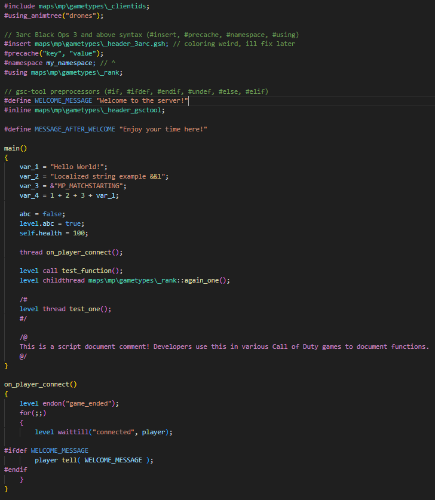

# vscode-gsc

A Visual Studio Code extension that adds language support for `.GSC` and `.GSH` files used for ingame scripting on Call of Duty games. The extension supports all COD games, but is primarily focusing on Call of Duty: 4 and on. This is **NOT** a GSC compiler and is [a extension used in Visual Studio Code!](https://marketplace.visualstudio.com/items?itemName=mjkzy.vscode-gsc-ultimate)

_This is a modified fork of [vscode-cod-gsc](https://github.com/eyza-cod2/vscode-cod-gsc)._

> [!WARNING] 
> This extension is still in development. For current functionality, check the [List of Features](#list-of-features).

## Supported Games

| Game           | Code | Status             | Not working yet                                                   |
|----------------|------|--------------------|------------------------------------------------------------------ |
| CoD1           | IW1  | ✅ |                                                                                  |
| CoD2           | IW2  | ✅ |                                                                                  |
| CoD4           | IW3  | ✅ |                                                                                  |
| CoD5           | T4   | ✅ |                                                                                  |
| MW2            | IW4  | ✅ |                                                                                  |
| BO1            | T5   | ✅ |                                                                                  |
| MW3            | IW5  | ✅ |                                                                                  |
| BO2            | T6   | ❗ | order of file references, param default value, const, `%xxx::yyy`                |
| Ghosts         | IW6  | ✅ |                                                                                  |
| AW             | S1   | ✅ |                                                                                  |
| BO3            | T7   | ❌ | `.gscc`, `.cscc`                                                                 |
| IW             | IW7  | ✅ |                                                                                  |
| CoD4:MWR       | H1   | ❗ | param default value                                                              |
| WWII           | S2   | ❔ |                                                                                  |
| BO4            | T8   | ❌ |                                                                                  |
| MW (2019)      | IW8  | ❌ |                                                                                  |
| BOCW           | T9   | ❌ |                                                                                  |
| Vanguard       | S3   | ❌ |                                                                                  |
| MWII           | IW9  | ❌ |                                                                                  |
| MWIII          | S4   | ❌ |                                                                                  |
| BO6            | T10  | ❌ |                                                                                  |

## Features

### Syntax Highlighting

  

### Completion Items (variables, preprocessors, functions, included functions, builtins, workspaces)

  
  
  
  
  
  

### Diagnostics (error messages, invalid file for #include/#using, possible missing semicolon)

  
  
  

### Functions (go to definition, hover info for various things, references, rename)

  
  
  
  
  
  

### Workspace folders
Visual Studio Code multi-root workspace can be used to "join" your mod folders as they get loaded into the game.

The order of how files are being searched is now determined by how the workspace folder appears in explorer tab. 
The last folder is searched first.

  

It can simulate your .IWD files - their file name determines which files gets loaded first in the game.

For example, this is typical setup:
- raw
- mod1
- mappack

From game perspective, it could represents these files:
- iw_00.iwd - iw15.iwd (original game files for CoD2)
- z_mod1.iwd
- zzz_mappack.iwd

The alphabetical order of .IWD is important to correctly replace original files.
The order of the workspace folders must be the same!

### Code actions (include folder for file reference, ignore missing)

  
  

### GSC Files

#### Visualization of replaced (unreachable) files.

When GSC file is replaced by another GSC file in multi-root workspace because of the same game path, the code in text editor is shown as semi-transparent (unreachable code) 

  

### Other

#### Status bar

  
  

## List of Features
- GSC file parser
  - Syntax parser
    - Comments (`/*...*/`, `//...`)
    - Developer blocks (`/# ... #/`, `/@ ... @/`)
    - Preprocessor (`#include`, `#using` (3arc), `#using_animtree`, `#animtree`, `#define`, `#if`, `#ifdef`, `#else`, `#endif`, `#undef`, `#precache` (3arc), `#insert` (3arc))
    - Keywords (`return`, `if`, `else`, `for`, `foreach`, `while`, `do-while`, `switch`, `continue`, `break`, `case`, `default`, `childthread`, `call`, `thread`, `wait`, `waittillframeend`, `waittill`, `waittillmatch`, `endon`, `notify`, `breakpoint`)
    - Operators (`=`, `+=`, `-=`, `*=`, `/=`, `%=`, `|=`, `&=`, `^=`, `++`, `--`, `+`, `-`, `*`, `/`, `%`, `|`, `&`, `^`, `<<`, `>>`, `==`, `!=`, `<`, `>`, `<=`, `>=`, `&&`, `||`, `!`, `~`)
    - Strings (`"default"`, `&"STRING_LOCALIZED"`, `#"sv_cvar_string"`)
    - Ternary conditional operators (`true ? "yes" : "no"`)
    - Anim string (`%xanim_file_name`)
    - Path (eg. `maps\mp\gametypes\sd`)
  - Detection of explicitly typed types of variables (string, localized string, cvar string, vector, integer, float, structure, array, function, entity, bool, xanim)
- Completion item provider (auto-suggestion)
    - <b>[NEW]</b> Builtin functions are now CoD4 functions (CoD2 exists for stuff like `getCvar()`)
    - Variables (local to function, global `level` and `game`)
    - Constants
    - Keywords 
    - File path
    - Local & included function definitions
    - External function definitions
- Diagnostics (errors and warnings)
  - Syntax error
    - Unexpected tokens
    - Missing semicolons
  - Extra semicolons
  - Invalid function parameters
  - Missing files
  - Invalid numbers of function parameters
  - Variables used before definition (could be better)
- Semantics token provider 
  - Proper colorization of tokens
- Definition and Reference provider
  - Local functions (`funcName()`)
  - External functions (`maps\mp\gametypes\file::funcName()`)
  - Included functions (via `#include` or `#using` in T7-T9)
  - Local & global variables (including function parameters)
  - Macros
- Hover provider
  - Function info with single & multi-line comments <b><i>(TODO: add ScriptDoc comments)</i></b>
  - Path info
  - QoL variable and preprocessor info (including function parameters)
  - Namespace definition
- Code action provider
  - Adding missing files into ignored list
  - Adding undefined functions into ignored list
- Rename provider
  - Function rename
  - Local & global variable rename
  - Local file pvscreprocessor rename
- Call hierarchy
  - Local, external, & included functions shown

  

## TODO list
### Priority
- Add custom global include list of GSC function
- Support for default function parameter value - supported in newer COD games
- When renaming GSC file, ask for reference update in other GSC files
### Non priority
- Code action - implement unknown function
- Add .csc files (client side scripts)
- Parser for .menu files
- Improve detection of variable types - now it's detected only by explicitly assigned constant value
- Show available string constants for `notify` `waittill` `waittillmatch` `endon` in completion item provider
- Check for unreachable code

## Install
This extension will soon be available through Visual Studio Marketplace under "vscode-gsc".

## Support
[Click here to tip the original developer via PayPal!](https://www.paypal.com/donate/?hosted_button_id=R59Y6UN9LJVXQ)
